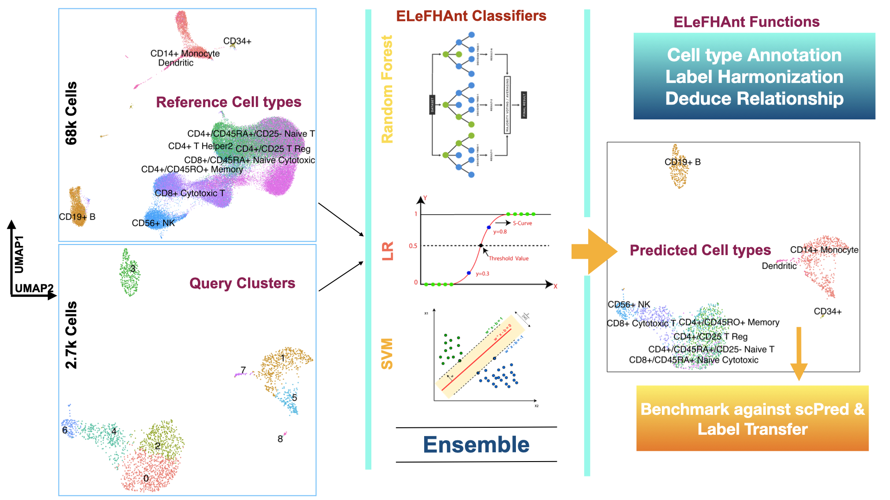

[](https://github.com/praneet1988/ELeFHAnt)

# ELeFHAnt
Ensemble Learning for Harmonization and Annotation of Single Cells (ELeFHAnt) provides an easy to use R package for users to annotate clusters of single cells, harmonize labels across single cell datasets to generate a unified atlas and infer relationship among celltypes between two datasets. It uses ensemble of randomForest (RF), Support Vector Machines (SVM) and Logistic Regression (LR). It has Six main functions 1) CelltypeAnnotation 2) LabelHarmonization 3) DeduceRelationship 4) Benchmark ELeFHAnt 5) CrossSpecies Conversion and 6) Validate Predictions

## ELeFHAnt Model


## Version 1.1.4 is now available
* Uses three classifiers to form an ensemble to classify cells [RF, SVM and LR].
* Improved speed (5X faster classification)
* Validate Predictions using GSEA msigdb [C8] (https://www.gsea-msigdb.org/gsea/msigdb/collections.jsp#C8) and CellMarkers Database markers (http://bio-bigdata.hrbmu.edu.cn/CellMarker/) [Experimental Markers]
* Users can select species (human or mouse) and tissues of interest for predicted celltype Marker validation. [Dotplots and Feature plots are generated for query/integrated data]
* Users now can compare ELeFHAnt predictions against Seurat's Label Transfer and scPred by using BenchmarkELeFHAnt function
* A complete tutorial using PBMC datasets is provided. Reference [https://www.nature.com/articles/ncomms14049] and query [https://cf.10xgenomics.com/samples/cell/pbmc3k/pbmc3k_filtered_gene_bc_matrices.tar.gz]

## Where to find previous versions
Users can access ELeFHAnt previous releases from Releases section of GitHub [https://github.com/praneet1988/ELeFHAnt/releases]

## Installation
```
library(devtools)
devtools::install_github('praneet1988/ELeFHAnt')
library(ELeFHAnt)
```
```
If you encounter any problems, try manually installing from the .zip or .tar.gz file with "R CMD INSTALL". 
```

## Complete Guided Tutorial using PBMC datasets
https://rpubs.com/praneet1988/ELeFHAnt

## Random Forest
Random Forests is a powerful tool used extensively across a multitude of fields. It is based on generating a large number of decision trees, each constructed using a different subset of your training set. These subsets are usually selected by sampling at random and with replacement from the original data set. The decision trees are then used to identify a classification consensus by selecting the most common output.

## SVM (Support Vector Machines)
SVM is a well-established supervised machine learning algorithm. It finds a hyperplane that separates data points into classes, where training occurs through “maximizing the margin”. Training time tends to be longer as data increases. SVM was ranked highly for cell annotation when benchmarked against other tools.

## LR (Logistic Regression)
Logistic regression estimates the probability of an event occurring, such as voted or didn't vote, based on a given dataset of independent variables. Since the outcome is a probability, the dependent variable is bounded between 0 and 1

## Ensemble Learning
ELeFHAnt provides users the ability to use ensemble learning for classification using three classifiers.

## Celltype Annotation Function
Celltype annotation is a function used to annotate celltypes in single cell datasets. It requires a reference dataset (a processed Seurat Object with Celltypes column in metadata) and a query dataset (a processed seurat object with seurat_clusters column in metadata). One can choose from randomForest, SVM or Ensemble classifiction methods to learn celltypes from the reference dataset and then predict celltypes for query dataset.

## Label Harmonization Function
Label Harmonization is a function used to harmonize cell labels (celltypes) across single cell datasets. It requires a list of processed Seurat Objects with a Celltypes column in metadata or an integrated seurat object (seurat object with Celltypes and seurat_clusters columns in the metadata). One can choose from randomForest, SVM or Ensemble classifiction methods.

## Deduce Relationship Function
Deduce Relationship is a function used to infer the similarity between celltypes across single cell datasets. The output is a heatmap that shows which celltype in one reference best corresponds to a celltype in another reference. It requires two reference datasets (both processed Seurat Objects with Celltypes columns in the metadata). One can choose from randomForest, SVM or Ensemble classifiction methods.
  
## BenchmarkELeFHAnt Function
Benchmark ELeFHAnt is a function to compare ELeFHAnt celltype predictions against scPred and Seurat's Label Transfer.


## Developers
```
Praneet Chaturvedi (MS Bioinformatics) : Lead Analyst Bioinformatics, Cincinnati Children's Hospital and Medical Center, Cincinnati, OH - USA
GitHub Username: praneet1988

Konrad Thorner (MS Bioinformatics) : Analyst Bioinformatics, Cincinnati Children's Hospital and Medical Center, OH - USA
GitHub Username: kthorner
```

## Citation
Please cite our preprint: https://www.biorxiv.org/content/10.1101/2021.09.07.459342v1 when using ELeFHAnt in your research.

## Bugs/Issues
Please report bugs, issues and improvements using the issues section of the GitHub page.

## Contribute to Code
Please open a pull request to contribute to existing code in terms of improvements / new features / bug removal.
